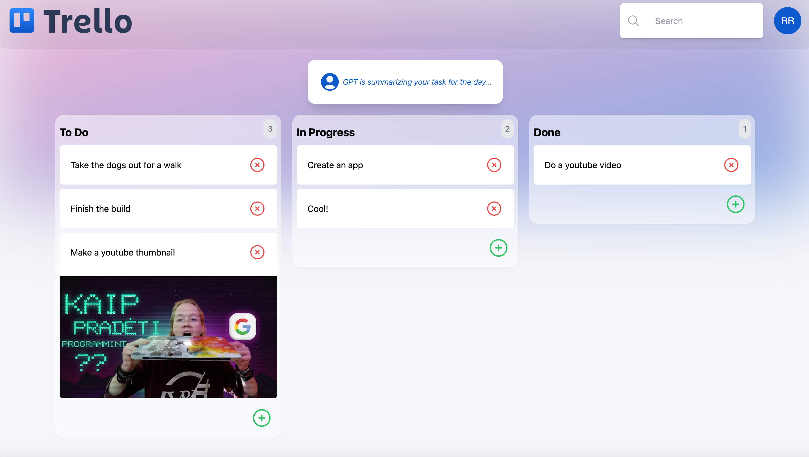

This is ai task manager tool, which is using GPT-4.



## Getting Started

First, run the development server:

```bash
npm run dev
# or
yarn dev
# or
pnpm dev
```

Open [http://localhost:3000](http://localhost:3000) with your browser to see the result.

## How to use

1. Click the `+` button to add a new task.
2. Click the `...` button to edit the task.
3. Click the `...` button to delete the task.
4. Click the `...` button to complete the task.
5. Click the `...` button to uncomplete the task.
